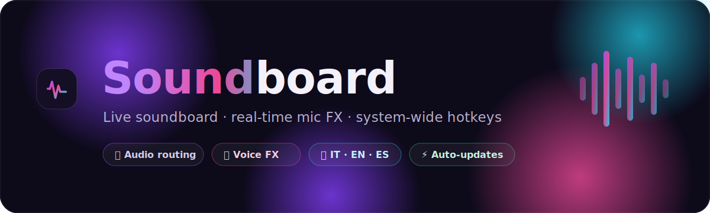
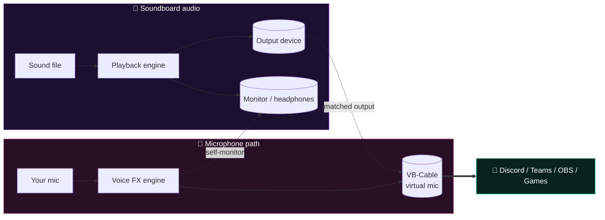

<div align="center">



<br/>

[](https://github.com/pinzis/SoundBoardApp/releases/latest)
[](https://github.com/pinzis/SoundBoardApp/releases)
[](#-installation)
[](https://www.electronjs.org/)
[](#-license)

**A modern desktop soundboard with real-time microphone effects, full audio routing, and system-wide hotkeys.**

[⬇️ Download](https://github.com/pinzis/SoundBoardApp/releases/latest) ·
[✨ Features](#-features) ·
[🎚️ How it works](#️-how-it-works) ·
[🛠️ Build](#️-build-from-source)

</div>

---

## ✨ Overview

**Soundboard** lets you trigger sounds during calls, streams, and games — and route both your **soundboard audio** and your **filtered voice** into any app (Discord, Teams, OBS, games…) via a virtual microphone. It ships with a slick *Aurora* glass UI, a live spectrum visualizer, six real-time voice effects, and a guided first-launch setup in **Italian, English, and Spanish**.

> Built as a three-process Electron app with a custom `media://` protocol and a dual–`AudioContext` engine for independent playback and monitor routing.

---

## 🎯 Features

| | |
|---|---|
| 🎛️ **Pad grid** | Drag-and-drop sounds, organize them into colored categories, search instantly. |
| ⌨️ **Global hotkeys** | Trigger any sound system-wide, even when the app is in the background. |
| 🎤 **Real-time voice FX** | Six presets (Girl, Mask, Underwater, Robot, Echo, Phone) with adjustable intensity. |
| 🔀 **Full audio routing** | Separate output, app-input, and headphone-monitor devices. |
| 🔌 **Virtual mic** | One-click **VB-Cable** detection & install to carry your audio into other apps. |
| 🎚️ **Per-sound control** | Individual volume, color, fade in/out, and a global amplifier (boost above 100%). |
| 📈 **Live visualizer** | Aurora-gradient canvas spectrum that reacts to playback. |
| 🌐 **Multilanguage** | Full UI in 🇮🇹 Italian · 🇬🇧 English · 🇪🇸 Spanish. |
| ⚡ **Auto-updates** | Background update checks on launch, with restart-to-install prompt. |
| 🎬 **Audio & video** | Supports `MP3`, `WAV`, `OGG`, `M4A`, and `MP4`. |

---

## 🎚️ How it works

Soundboard runs **two independent audio paths** plus an optional mic-effects engine, so what *you* hear and what *other apps* hear can be routed to different devices.



- **Output device** — where the soundboard plays (your speakers/headphones).
- **App input (VB-Cable)** — a virtual microphone that other apps select as their mic, so they hear your soundboard *and* your effected voice.
- **Monitor** — an optional second device so you hear your own filtered voice in your headphones.
- **Amplifier** — a shared gain stage that can boost both paths above 100%.

> 💡 To use your voice with effects in other apps, install **VB-Cable** (one click in Settings) and select it as the microphone inside Discord/Teams/OBS.

---

## 🎤 Microphone effects

| Preset | Sound |
|---|---|
| 🚫 **None** | Clean pass-through |
| 👧 **Girl** | Higher, brighter voice |
| 🎭 **Mask** | Deeper, anonymized voice |
| 🌊 **Underwater** | Muffled, wobbling filter |
| 🤖 **Robot** | Ring-modulated metallic tone |
| 🔊 **Echo** | Delay / repeat tail |
| ☎️ **Phone** | Narrow-band telephone EQ |

Each preset has an **intensity** slider and an optional **self-monitor** so you can hear yourself while you talk.

---

## ⬇️ Installation

1. Go to the [**latest release**](https://github.com/pinzis/SoundBoardApp/releases/latest).
2. Download **`Soundboard-Setup-x.y.z.exe`**.
3. Run the installer and pick your install folder.

> ⚠️ The app is unsigned, so **Windows SmartScreen** may warn on first run.
> Click **More info → Run anyway**.

Once installed, the app **checks for updates automatically** on every launch, downloads them in the background, and prompts you to restart & install.

---

## 🚀 First launch

A guided two-step wizard runs the first time you open the app:

1. **🌐 Choose your language** — Italian, English, or Spanish.
2. **🎤 Set up your microphone** — pick your mic, soundboard output, and (optionally) a headphone monitor.

Everything can be changed later from **Settings → Audio Routing**.

---

## 🛠️ Build from source

```bash
git clone https://github.com/pinzis/SoundBoardApp.git
cd SoundBoardApp
npm install

npm start          # run in development
npm run build      # build the Windows installer → dist/
npm run release    # build + publish to GitHub Releases (needs GH_TOKEN)
```

> Requires **Node.js** and **npm**. The build target is **NSIS** (required for auto-updates).

---

## 🧩 Tech stack

- **[Electron](https://www.electronjs.org/) 31** — desktop shell (main / preload / renderer, `contextIsolation` on)
- **Web Audio API** — dual `AudioContext` engine, per-effect graphs, canvas analyser
- **[electron-builder](https://www.electron.build/)** + **[electron-updater](https://www.electron.build/auto-update)** — packaging & auto-updates
- **Vanilla JS + CSS** — no bundler; `oklch` color tokens and glassmorphism UI
- Custom `media://` protocol for safe local-file audio playback

---

## 📊 Downloads

[](https://github.com/pinzis/SoundBoardApp/releases/tag/v1.1.0)
[](https://github.com/pinzis/SoundBoardApp/releases/tag/v1.0.0)
[](https://github.com/pinzis/SoundBoardApp/releases)

*Badges update automatically from the GitHub Releases API.*

---

## 📄 License

Released under the **MIT License**.

<div align="center">

<br/>

**Made with 🎧 by [Inzi](https://github.com/pinzis)**

<sub>If you find this useful, consider leaving a ⭐ on the repo!</sub>

</div>
